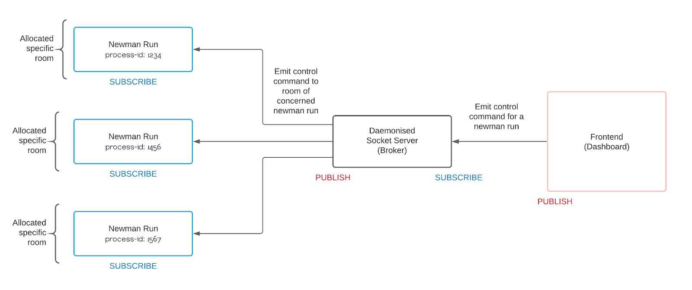

# Architecture

Newman Dashboard is a real-time reporter for newman to control, view and debug runs on a WebUI dashboard.

## Pub - Sub

We establish a pub/sub architecture between the newman runs and the WebUI(frontend) through a central server known as the broker. <br/>
The frontend and the runs never know about one another directly, they just connect to the broker as clients.<br/>
The broker pushes each of these clients into separate "rooms" to maintain abstraction and isolation between them i.e. every client should receive messages concerned with itself and no other client. <br/>

## Flow

### Connecting a newman run to broker

For connecting a newman run to the broker there are 2 prerequisites:

1. Dashboard should be started on `http://localhost:5001/` using the newman-dashboard CLI
2. `newman-dashboard` should have been provided as a reporter for that newman run.

```
newman run <collection> -r dashboard
```

1. When this newman run will execute, the reporter will try to connect to the broker at `http://localhost:5001/`.
2. For this connection to be authenticated, it would need to provide 2 things during the socket handshake:
    - A unique id to solely identify this run.
    - The type of this client, in this case `newman-run`
3. Upon authentication, the broker will push this client to a specific room where it can receive events related to its underlying run.
4. Newman emits a `start` event on the actual start of the newman run, this would be sent by the reporter to the broker. The broker would publish this to the frontend.
5. The frontend would then store this run's status and corresponding `id` in its local store and it would then be visible to the users.

### From newman run to WebUI

1. newman emits an event regarding the state of an underlying run like `abort`, `start`, `pause` etc.
2. The reporter has mounted listeners for these events, and on any such instance, it publishes this message to the broker along with a unique `id` to identify this particular run.
3. The broker, on receiving this, publishes a new message to the frontend, informing it about this action.
4. The frontend, upon receiving the message by the broker, changes the state of that particular newman run (identified by its `id`) to what it issued to the broker.
5. This change is then reflected on the WebUI and visible to the user.

Using sockets, this process is almost instantaneous with almost no lag.


### From WebUI to newman run

1. The user issues a command request for a newman run by clicking on any of the pause, abort or resume buttons.
2. The frontend, extracts the unique `id` of this run from its local state and publishes this request to the broker.
3. The broker, then publishes this request to the room where the newman run client having the provided `id` is subscribed to.
4. The newman run's reporter on receiving this message, emits an event to newman to `pause`, `abort` or `start` the run.
5. This is then reflected on the console, and the newman run is actually paused/aborted.


